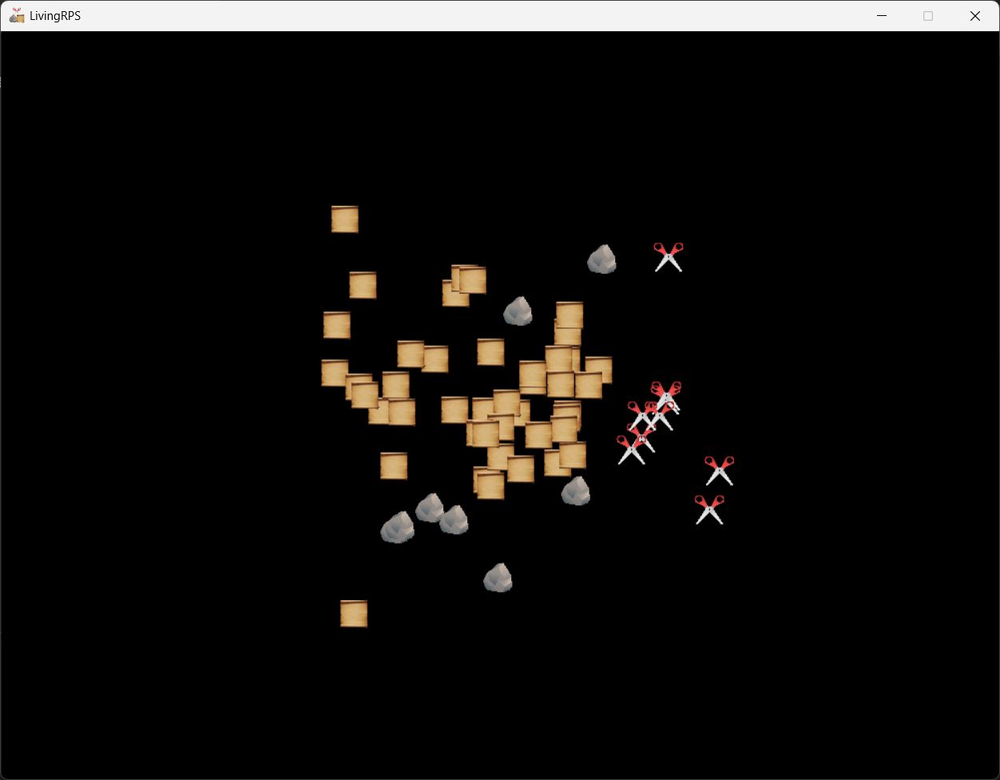

<h1 align="center">
    
    <br>LivingRPS
</h1>

<p align="center">AI-integrated Rock-Paper-Scissors simulation game where each player is an AI (updated).</p>

## 1. Installation

1. Ensure Python is installed on your system.
2. Install the required libraries using the following command:
    ```bash
    pip install numpy pygame torch
    ```

## 2. Training the Model (Optional)

If necessary, train the model by double-clicking `install.bat`, or by running:
    ```bash
    python train.py
    ```

## 3. Running the Game

- Double-click `run.bat`, or
- Run the following command in your terminal:
    ```bash
    python main.py
    ```



> This project is a fork of [ethan-schaffer/LivingRPS](https://github.com/ethan-schaffer/LivingRPS) with enhancements and improvements. It is not the original version.