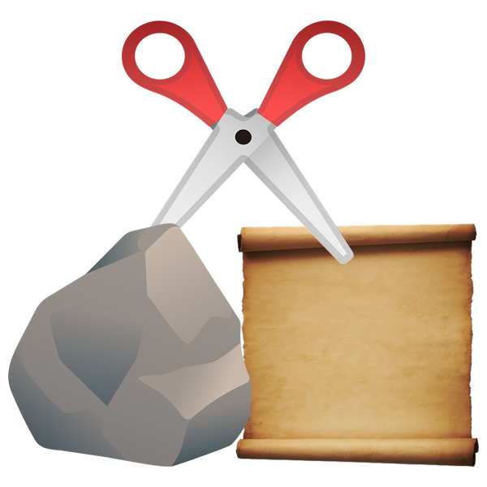
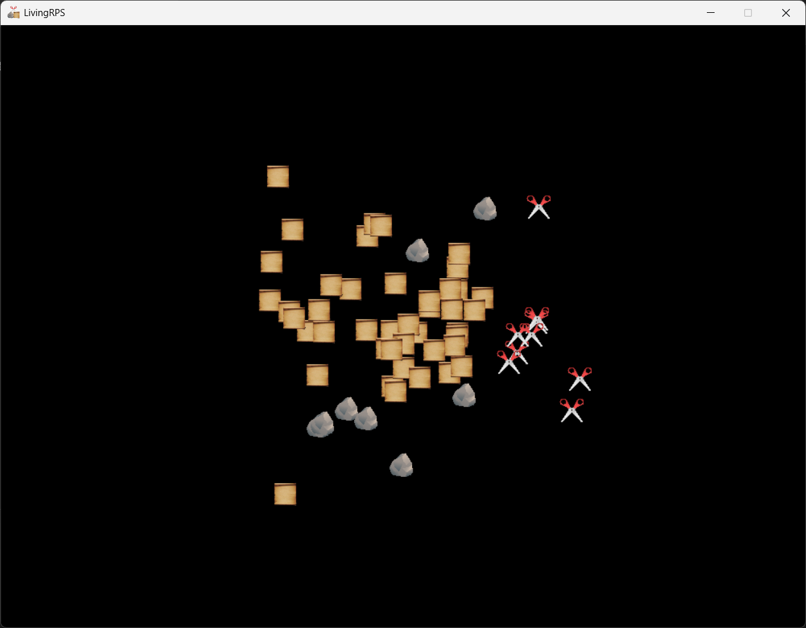

<div align="center">

<br>
<h1><b>LivingRPS</b></h1>

<i>
AI-powered Rock-Paper-Scissors simulation — each entity is a DQN agent, hunting its prey and evading its predator.
</i>



</div>

---

## 🚀 Requirements

- Python 3.9+
- Dependencies from `requirements.txt`

**Install dependencies:**
```bash
pip install -r requirements.txt
```

---

## 🕹️ Running the Simulation

### Quick Start (Windows)

Double-click `run.bat` to:
- Check for Python
- Install dependencies (if needed)
- Train the model (if weights are missing)
- Launch the game

### Manual Launch

```bash
python main.py
```

---

## 🧠 Training the Model (Optional)

A pre-trained model is included at `models/rps_agent.pth`.

To train a new model from scratch:
```bash
python train.py
```