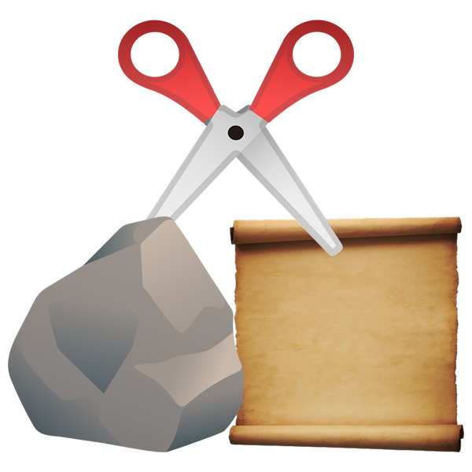

<h1 align="center">
  <br>
  <b>LivingRPS</b>
</h1>

<p align="center">
  <i>AI-powered Rock-Paper-Scissors simulation — each entity is a DQN agent, hunting its prey and evading its predator.</i>
</p>

<p align="center">
  
</p>

---

## Requirements

- Python 3.9 or higher
- `requirements.txt` dependencies

Install all dependencies:

```bash
pip install -r requirements.txt
```

---

## Running the Simulation

**Quick Start (Windows):**  
Double-click `run.bat`. This script will:

- Check for Python
- Install dependencies if needed
- Train the model if weights are missing
- Launch the game

**Manual Launch:**

```bash
python main.py
```

---

## Training the Model (Optional)

A pre-trained model is provided at `models/rps_agent.pth`.  
To train a new model from scratch:

```bash
python train.py
```

---

> Forked from [ethan-schaffer/LivingRPS](https://github.com/ethan-schaffer/LivingRPS) with enhanced AI and improved structure.